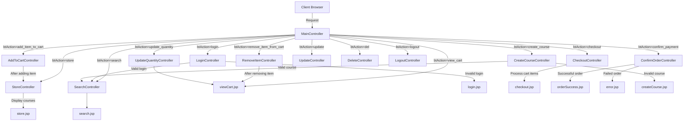

# Shopping - Course Registration System

## Description
Shopping is a web-based application for managing and registering for educational courses. The system allows users to browse available courses, add them to a cart, and complete registration. Administrators can manage course offerings, including creating, updating, and deleting courses.

## Features
- User authentication (login/logout)
- Role-based access control (admin/regular users)
- Course browsing and searching
- Shopping cart functionality
- Order checkout and confirmation
- Course management (admin)
- Responsive UI design

## Technologies Used
- Java EE (Servlets, JSP)
- JSTL (JavaServer Pages Standard Tag Library)
- SQL Server Database
- JDBC for database connectivity
- Apache Tomcat server
- HTML/CSS
- MVC Architecture

## Project Structure
- src/java/: Java source files
  - ducpt/controller/: Servlet controllers
  - ducpt/database/: Database connection classes
  - ducpt/entity/: Entity classes
  - ducpt/registration/: User and course registration logic
  - ducpt/log/: Logging functionality
- web/: Web resources
  - WEB-INF/: Configuration files
  - META-INF/: Context files
  - JSP files for views

## Database Setup
1. Execute the db_script.sql script to create the database and necessary tables
2. The database includes:
   - Users table for authentication
   - Courses table for course information
   - Additional tables for registration functionality

## Configuration
1. Database connection is configured in:
   - ducpt/database/DatabaseConnection.java
   - ducpt/database/DBUtils.java
2. Web application context is configured in:
   - web/META-INF/context.xml

## Installation and Setup
1. Clone the repository
2. Make sure SQL Server is running and the database is set up
3. Configure the database connection details if needed
4. Deploy the application to Apache Tomcat server
5. Access the application at: http://localhost:8080/Shopping/

## Usage
1. Login with provided credentials
   - Admin: username admin, password admin
   - Regular user: username jane.smith, password jane
2. Browse courses from the main page
3. Add courses to your cart
4. Proceed to checkout to complete registration
5. Admins can create new courses and manage existing ones

## Building the Project
The project uses Apache Ant for building:
- Build the project: ant build
- Clean the project: ant clean
- Deploy to server: ant run-deploy

## Requirements
- JDK 1.8 or later
- Apache Tomcat 8.0 or later
- SQL Server database
- Microsoft JDBC Driver for SQL Server

# Application Controller Flow

## Main Flows:

1. **Authentication Flow**:
   - Client → MainController → LoginController → (if valid) → SearchController
   - Client → MainController → LogoutController → SearchController/login.jsp

2. **Shopping Flow**:
   - Client → MainController → StoreController → store.jsp
   - Client → MainController → AddToCartController → StoreController → store.jsp
   - Client → MainController → view_cart → viewCart.jsp
   - Client → MainController → RemoveItemController → viewCart.jsp
   - Client → MainController → UpdateQuantityController → viewCart.jsp
   
3. **Checkout Flow**:
   - Client → MainController → CheckoutController → checkout.jsp
   - Client → MainController → ConfirmOrderController → orderSuccess.jsp/error.jsp

4. **Course Management Flow** (Admin):
   - Client → MainController → CreateCourseController → createCourse.jsp/search.jsp
   - Client → MainController → UpdateController → search.jsp
   - Client → MainController → DeleteController → search.jsp

All actions are coordinated through the MainController which acts as a front controller that routes requests to the appropriate controller based on the "btAction" parameter.
